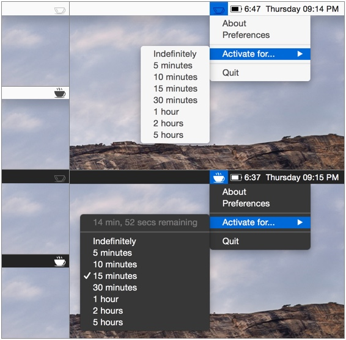

# Caffeinator #

Caffeinator is a menu bar utility based off of Lighthead Software's [Caffeine](http://lightheadsw.com/caffeine/) and Marcel Dierkes' [KeepingYouAwake](https://github.com/newmarcel/KeepingYouAwake). It allows you to prevent your Mac from going to sleep and your screen from turning off.

I wrote this clone because Caffeine hasn't been updated in a long time and I wanted to tweak some behaviors of KeepingYouAwake. Also, I'm an iOS developer and I wanted to try my hand at the other side (this is my first OS X app). Additionally, this app is written completely in Swift.

## Installation

You can download the compiled app [here](https://github.com/jsmerola/Caffeinator/releases)

or you can build the code yourself using Xcode 7.

## Requirements ##

* OS X 10.10 Yosemite or later
* Xcode 7 or later (if you want to build the source)

## Disclaimer ##

Although this application is essentially just a wrapper around Apple's caffeinate utility, I make no promises about the safety of this application. Thus, use this application at your own risk.

## Credits ##

Lighthead Software for the original application, Caffeine.  
Marcel Dierkes for the open-source Objective-C clone, KeepingYouAwake.

## License ##

Caffeinator is released under the MIT license. See LICENSE for details.